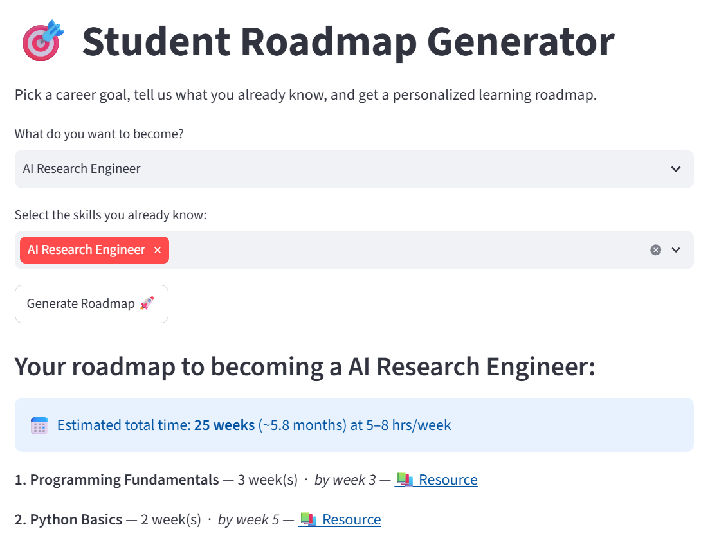

# 🎯 Student Roadmap Generator

A personalized career roadmap generator built with Python, NetworkX, and Streamlit. 
Given a career goal and the skills you already know, it generates a step-by-step 
learning path with time estimates and free learning resources — visualized as an 
interactive flowchart.

## ✨ Features

- **13 career paths** across Data Science, Web Development, Mobile, DevOps, 
  Cybersecurity, QA, Game Development, Blockchain, and Product Management
- **~65 skill nodes** with prerequisite relationships modeled as a directed graph
- **Personalized roadmaps** — excludes skills you already know using topological sort
- **Time estimates** — see how many weeks each skill takes and your total timeline
- **Free resource links** for every skill
- **Visual flowchart** of your roadmap using NetworkX + Matplotlib

## 🛠️ Tech Stack

- Python
- Streamlit (web UI)
- NetworkX (graph modeling + topological sort)
- Matplotlib (roadmap visualization)

## 📂 Project Structure
student-roadmap-generator/
├── app.py              # Streamlit UI
├── skill_graph.py       # Skill graph data, roadmap logic, visualization
├── requirements.txt      # Dependencies
└── README.md

## 🚀 Getting Started

1. Clone this repo:
```bash
   git clone <https://github.com/Anushka02-tech/Student-roadmap-generator>
   cd student-roadmap-generator
```

2. Install dependencies:
```bash
   pip install -r requirements.txt
```

3. Run the app:
```bash
   streamlit run app.py
```

4. Open the local URL shown in your terminal (usually `http://localhost:8501`)

## 🧠 How It Works

Skills and career goals are modeled as nodes in a directed acyclic graph (DAG), 
where edges represent prerequisite relationships. When a user selects a goal, 
the app:

1. Finds all ancestor skills (prerequisites) of the goal using `networkx.ancestors()`
2. Removes skills the user already knows
3. Orders the remaining skills using topological sort, so prerequisites always 
   come before dependent skills
4. Calculates a cumulative timeline based on estimated weeks per skill
5. Renders the ordered path as a visual flowchart

## 🔮 Future Improvements

- Progress tracking with persistence (save completed skills)
- LLM-generated explanations for why each skill matters at each stage
- Auto-detect known skills from a resume upload

## 📸 Demo

🔗 Live app: https://student-roadmap-generator-yj4epbjuaeg6bqppmtbhjf.streamlit.app/



## 👤 Author

Built by Anushka Arora as a summer internship project.
